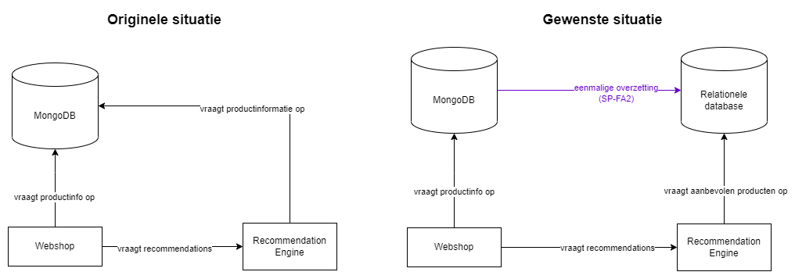

# Structured Programming 2023

Deze repository bevat de voorbeelden uit de lessen Structured Programming voor V1B aan 
Hogeschool Utrecht.

# Divers

* **Les 1**: Voor deze les hebben we het voorbeeld met de frisdrankautomaat van PROG-FA1. Ga ook vast aan de slag met formatieve opdracht 1a ter voorbereiding van Mastermind.
* **Les 9**: In deze les met V1A en V1B hebben we gekeken naar veel gemaakte fouten in bijv. de Mastermind opdracht.

# Mastermind

* **Les 2**: In deze les hebben we een begin gemaakt aan een guessing game, waarbij een kleur geraden kan worden. Dit zal verder uitgebreid worden. Daarnaast hebben we een scriptje om permutaties te genereren, zodat we weten wat de mogelijke codes zijn.
* **Les 3**: In deze les zijn we bezig geweest met een feedbackfunctie en de bijhorende frequentietabellen. Let op: deze functies zijn nog aangepast na deze les om fouten te corrigeren.
* **Les 4**: In deze les is de feedbackfunctie vervangen door één van het internet: de frequenties bleken niet overeen te komen met de frequenties uit de paper. De oude versie is vervangen in de repository om verwarring te voorkomen. Daarnaast hebben we Mastermind functioneel gemaakt en kunnen we aan de slag met AI.
* **Les 5**: In deze les is de reduce-functie behandeld, om de nieuwe mogelijkheden te bepalen waar de AI vervolgens uit kan kiezen.
* **Les 6**: In deze les hebben we het programma opgedeeld in meerdere modules. Ook hebben we input-validatie behandeld.

# MongoDB & Relationele Databases
* **Les 7**: In deze les hebben we de opdracht besproken. De folder bevat een voorbeeld over iterables en over het inlezen van producten met pymongo.
* **Les 8**: In deze les is geen code geschreven, vanwege een verwonding aan mijn hand.

